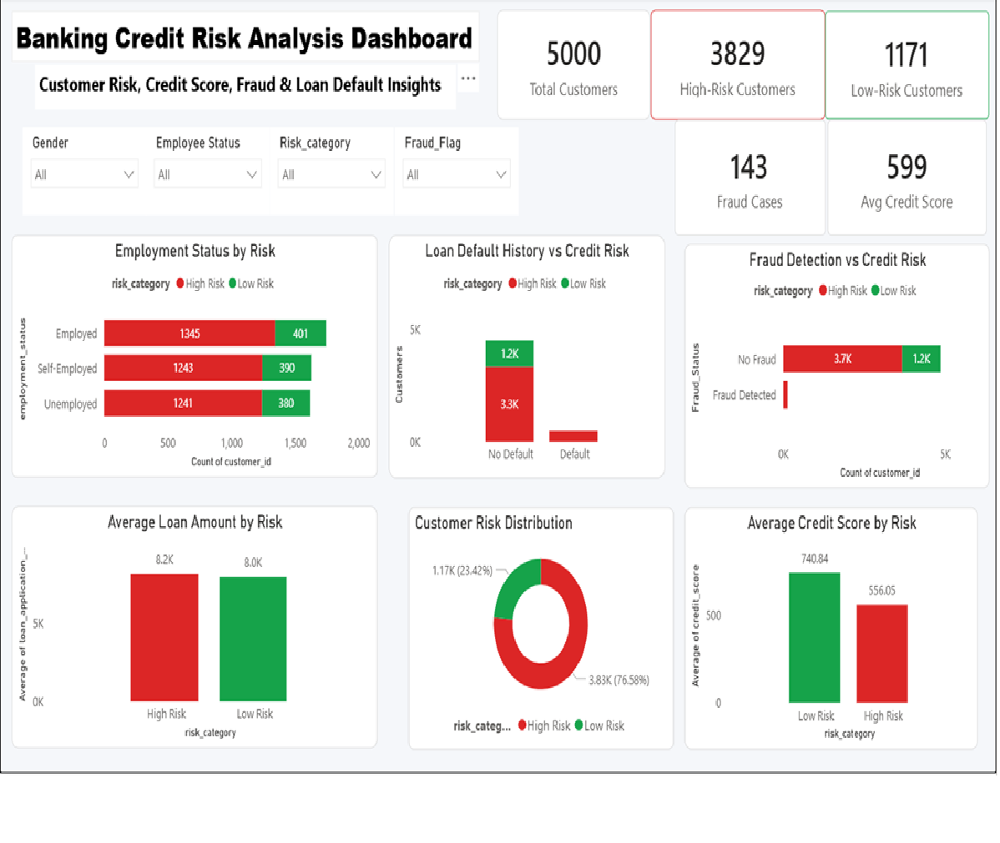

# 🏦 Banking Credit Risk Analysis

## 📌 Overview

This project analyzes banking customer data to identify high-risk customers, assess creditworthiness, detect fraud patterns, and evaluate loan default behavior.
Using Python, MySQL, and Power BI, the project transforms raw banking data into actionable business insights through data analysis, SQL-based risk assessment, and interactive dashboard visualization.

## 🛠️ Tools Used

- Python (Pandas, Matplotlib)
- MySQL
- Power BI

## 📊 Dashboard Preview



## 🎯 Key Features

- Credit Risk Classification
- Credit Score Analysis
- Fraud Detection Analysis
- Loan Default Analysis
- Employment Risk Analysis
- Interactive Power BI Dashboard

## 🗄️ SQL Analysis

Performed analysis using:

- Aggregations (COUNT, AVG)
- CASE Statements
- Window Functions (RANK)
- Customer Risk Segmentation
- Fraud & Default Analysis

## 💡 Key Insights

- 76.6% of customers were classified as High Risk.
- High-risk customers had significantly lower credit scores.
- All customers with previous loan defaults belonged to the High-Risk category.
- Fraud-flagged customers were entirely concentrated in the High-Risk segment.
- Income and loan amount showed limited impact on risk classification.

## 📂 Project Structure

```text
Banking-Loan-Risk-Analysis/
│
├── Dataset/
├── Python/
├── SQL/
├── PowerBI/
├── Screenshots/
└── README.md
```

## 🚀 Business Outcome

This project demonstrates:

- Data Cleaning & EDA
- SQL-Based Risk Analysis
- Credit Risk Assessment
- Fraud Detection
- Interactive Dashboard Development
- Business Insight Generation

